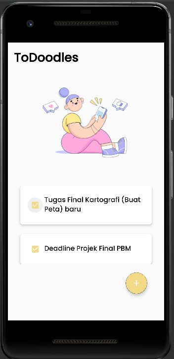
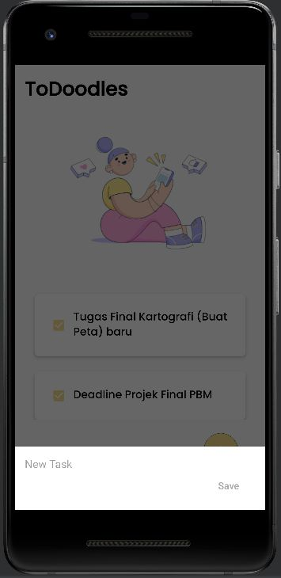
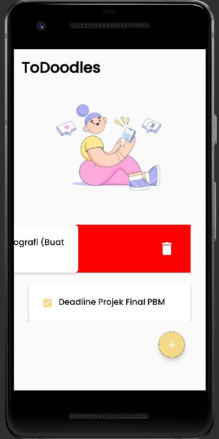
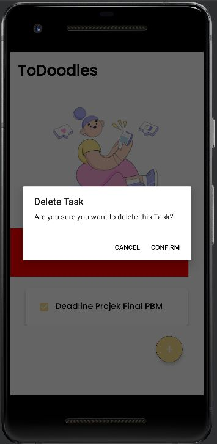
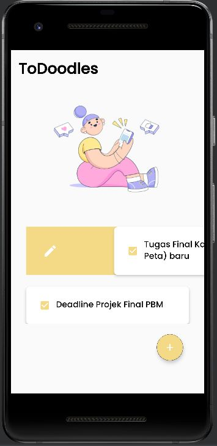
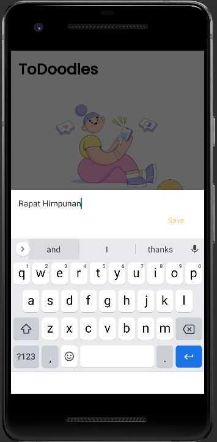

# Projek_PBM_ToDoodles

## Anggota Kelompok
1. Farrah Fahira Murzani (2008107010062)
2. Rizka Nuzulia (2008107010012)

## Deskripsi Projek
To Doodles adalah aplikasi mobile yang memungkinkan pengguna untuk membuat, mengedit, dan menghapus daftar tugas harian mereka. Dengan antarmuka sederhana, pengguna dapat dengan mudah menambahkan tugas baru, mengubah informasi tugas yang ada, dan menghapus tugas yang selesai. Aplikasi ini juga menyediakan fitur tambahan seperti penandaan tugas selesai dan tampilan yang menarik untuk membantu pengguna dalam mengatur dan mengelola tugas mereka dengan efisien.

## Screenshot Tampilan Aplikasi

### Splash Screen / Launch Screen

### Layar Utama

### Add New Task

### Delete Task

### Confirm Delete Task

### Edit Task

### Edit Task to Save

